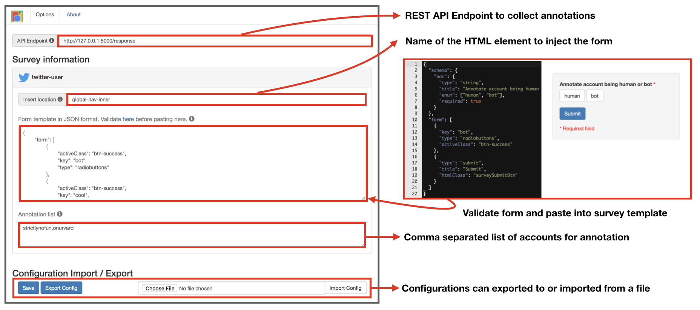

# Summary

Human annotated data is essential in building machine learning systems and analyzing online systems. Most research efforts go through cumbersome data collection phases where they either build complicated annotation pipelines for online data or annotate offline data shared on spreadsheets or surveys. These approaches introduce significant overhead to any study requiring data collection and causes researchers to divert significant effort away from analysis and modelling to data collection, especially when they have limited programming experience.
Here we present `Social-Annotate`, an extendable and configurable browser extension, to assist annotation and collection of online data. In this project we aim to develop a tool that can easily adapt to different tasks and extend to most online platforms. `Social-Annotate` allows collection of data directly on the online platform as a user sees and interacts with it as they normally would by injecting surveys into webpages on the browser, and annotations can easily be exported as files or sent to API endpoints for collaborative data collection. We aim with this tool to promote and expedite annotation of online datasets and reduce the data collection overhead so that researchers can focus on research.

# Introduction

Machine learning applications rely on high-quality annotated data to build supervised models. This is especially true in social media analysis, and models trained on account behavior and content have been used to detect automated activities and to study conversations in the past [@mitra2015credbank; @potthast2017stylometric; @shu2018fakenewsnet; @varol2017online; @yang2019arming]. 

Researchers are often faced with inefficient tasks of inspection and labeling to build such annotated datasets. Most data collection studies, content to be inspected is often shares as a collection of URLs contained in platforms such as online forms and spreadsheets. This content is then inspected manually by following the URL directly on a web-browser, or the content is isolated and extracted from its source on a separate data collection platform. Crowd-sourcing approaches can help scale the annotation task, however the cost of high-quality annotated data is still high with crowd-sourcing since performance non-expert users requires further validation or larger samples [@hsueh2009data; @see2013comparing]. A crowd-sourcing platform can also provide annotated data in a machine-readable format to help researchers get to the analysis more conveniently. 

While the data collection approaches described so far appear feasible, they often require a constant back-and-forth between the browser and forms, or display data that have been previously extracted alongside forms on a separate platform, isolated from the original online source of the content. Both of these approaches introduce significant overhead in collection, preparation, and access of content to be annotated. Furthermore, these approaches isolate content annotation task from the natural use of the online platform which may user experience and introduce or remove biases compared to regular users. Recommendation algorithms, the sequence content is loaded, and content layout on the page are some examples of these sources of influence inherent to each platform.

Aspects of this task that can be automated or augmented to help annotators and reduce overhead.
However, these automated approaches often require implementing custom data pipelines or tools. This introduces a cost of entry that excludes researchers with limited technical know-how or financial resources and makes studies of smaller scope less feasible in terms of effort or financial cost.  

Here we build `Social-Annotate`, an extendable and configurable browser extension for data collection, to achieve following goals:

- Bringing online data sources and data collection platform together to speed-up the annotation process.
- Survey forms that are easy to customize for non-technical users, and extendable for other websites. 
- Datasets collected for a study can be exported to JSON or CSV files, or submitted to an API endpoint automatically.
- Browser extension can inject survey question directly into websites so that annotation can be collected while interacting with the source platform naturally, or manipulate the displayed content for controlled studies.


# System design

We build our browser extension following the design guidelines and best practices provided by Google Chrome [Chrome extension: https://developer.chrome.com/extensions/overview](https://developer.chrome.com/extensions/overview). Extensions architecture mainly consists of following units:

- **manifest.json**: Provide information about the extension, functional elements of it, and necessary permissions. Required for every extension by Google Chrome. This configurations allows us to request permission to edit certain websites by injecting style and scripts.
    
- **Background scripts**: Handles background operations and listens for events interfacing with the extension.
    
- **Content scripts**: Main functional elements of the extension. Facilitates the interface between the page content, extension, and browser APIs.
    
- **Popup page**: A simple interface to control the extension, such as enable/disable, annotation statistics, and switching between different collection tasks.
    
- **Options page**: A page for configuring and customizing the extension to change the behavior of certain aspects. Configurations on this page can be exported to or imported from a file.
    


In Figure \autoref{fig:schema}, we present the high-level representation of the extension. Elements of the extension are presented in the middle panel. We implement a separate content script for each social media platform, and only inject the relevant scripts to the page. Content scripts inject the surveys to the page, where the injection location and the survey itself can be configured. Users can interact with the extension using "popup" and configure it using "options" pages. 

Our extension does not require any changes to the code for customizing the survey questions. We aim to be accessible for all users, especially those with limited programming experience. Surveys can be customized in the options page, and entire configurations including customized surveys can be exported as a configuration file that can be shared with study participants for easy onboarding.

Advanced users can also implement their own content scripts for extending to different platforms. Using this additional functionality, users can design their own data collection strategy and manipulate content for controlled studies. We are providing details on how to easily extend `Social-Annotate` for supporting other platforms.


# Annotation forms

Surveys can have an arbitrary number of questions of various types, according to the needs of the study. We rely on JSON schemas as templates for easy configuration and sharing custom survey forms. These surveys are then injected into the page when the URL matches with the target domain. It is possible to have different types of surveys for each platform, which will also effect which elements the surveys are injected to. For example, it is possible to annotate users or tweets on Twitter.



An example form is presented in Fig~\autoref{fig:example-form} (right) for social bot detection research. Users can easily design their own questions and provide the JSON schema code through the options page, or import from a configuration file prepared and distributed to the participants by researchers conducting the study. Using JSON schema to define survey forms gives access to a wide range of form elements and controls without writing any HTML code, and enables researchers with limited technical know-how to create custom forms easily following provided examples ([jsonform package: https://github.com/jsonform/jsonform](https://github.com/jsonform/jsonform))

Each survey form collects answers for survey questions, including but not limited to multiple choice and free text entry, as well as additional meta-data such as time it takes to answer each question and time of submission. This data is temporarily stored on the local storage of the browser, and can be exported to a file at any time. It is also possible to post each annotation to a remote server through HTTP requests. 


# Data collection

Collection of the survey responses are an important step prior to analysis of the outcomes. One of the common formats for analyzing such data is comma-separated files that can be opened using any spreadsheet application. Alternatively, programmatic manipulation of these results are also possible. Here we also consider exporting outcomes of the study in a JSON file where each survey response and their corresponding meta-data information are nested. 

Collecting annotation results from multiple users may require gathering all the exported files and merging them. To centralize all the responses into a single location, we also provide the option to send responses to a user defined API endpoint. Having a simple server-side application listening to this endpoint, users can gather results from multiple clients. We provide a sample Flask server-side application to demonstrate this functionality in our code repository. This feature can be used to enable easier crowd-sourcing.


# Extending to other platforms

`Social-Annotate` is designed with easy deployment to other platforms such as Instagram, Reddit, Facebook, etc. in mind. We demonstrate this extension process by extending `Social-Annotate` to support annotating users on Instagram. This section can be considered as a walk-through on extending for any other platforms. We welcome and strongly encourage contributions to our open-source repository.

`Social-Annotate` has a central configuration file, called `config.js`, that contains information on extensions custom properties and details about the surveys. First step of extending this tool to other platforms is adding a new survey object into "surveys" field as shown in the highlighted code block below. 


```javascript
# config.js
var config = {
    "exportFormat": "csv",
    "activeSurveys": ["twitter-user"], 
    "surveys": {
        "instagram-user":{
            "socialMediaPlatform": "instagram",
            "injectElement": {
              "name": "global-nav-inner", 
              "type": "class", 
              "index": 0
            },
            "surveyFormSchema" : {
                ...
            }
        },
        "twitter-user":{ 
            ...
        }
    }
};
```

Content scripts ...


Finally, we need to update `manifest.json` declare when the new content-script files and any other files needed for this addition to support a new platform should be injected to the page.


```javascript
# manifest.js
{
  "name": "Content Annotator",
  "version": "1.0",
  "manifest_version": 2,
  ... // Other configurations
  "content_scripts": [
   {
     "matches": [
        "*://twitter.com/*",
        "*://instagram.com/*"
     ],
     "css": [ 
       "content-scripts/instagram/inject.css",
       "content-scripts/twitter/inject.css",
       ... // Other CSS files
     ],
     "js": [
       "content-scripts/instagram/inject.js",
       "content-scripts/twitter/inject.js",
       "content-scripts/shared/shared.js",
       ... // Other JS files
     ]
   }
  ]
}
```


# Conclusion

Researchers have already been using browser extension to collect data on user behavior [@capra2010hci], crowdsourcing tags [@kaur2014scholarometer], study news consumption behavior of online accounts [@chakraborty2016stop], or identification of social bots [@khayat2019vassl].
Especially in domains require datasets collected from wide range of behaviors, sampling biases for annotation can be an issues. Crowdsourcing the annotation task to real users can reveal different types of accounts and users can label those accounts since they have been observing them in their own social media timelines. Tools for filtering social bot accounts becoming more important since platforms struggle catching up with the novel automated behaviors. Tools like [BotSentinel](http://botsentinel.com/) designed to mask problematic accounts, but such system can be instrumented for data collection and experimentation as well. `Social-Annotate` can be also extended to insert scores for social media users or content using popular services like [Botometer](https://botometer.iuni.iu.edu) and [Hoaxy](http://hoaxy.iuni.iu.edu/).

We hope that by providing this tool we will reduce the overhead required for data annotation and improve the feasibility of research projects with limited resources.

Finally, although we emphasize collecting annotated social media datasets as the main focus of this tool, it is possible to extend it to be used on any other website. We welcome and strongly encourage contributions to our open-sourced repository.


# Code repository

`Social-Annotate` is available online on our website and through Github repository listed below.

Resource     | URL
------------ | -------------
**Website**  | [http://uluturki.github.io/social-annotate](http://uluturki.github.io/social-annotate)
**Github**   | [https://github.com/uluturki/social-annotate](https://github.com/uluturki/social-annotate)


# References